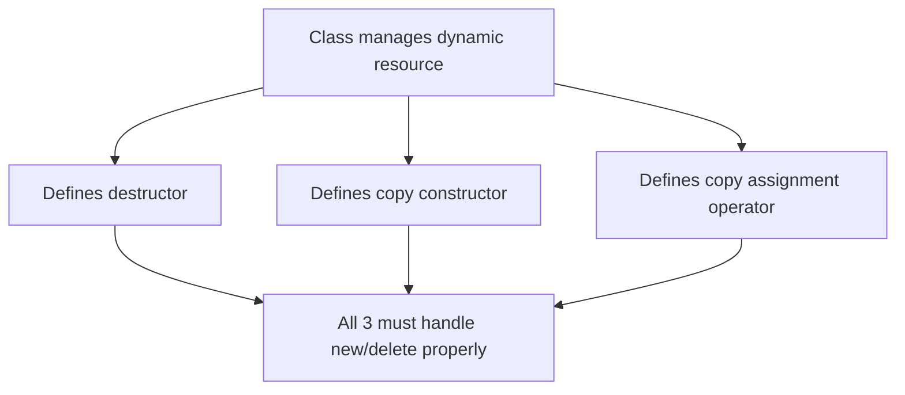
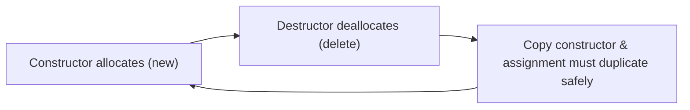
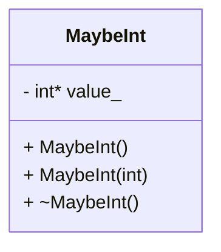
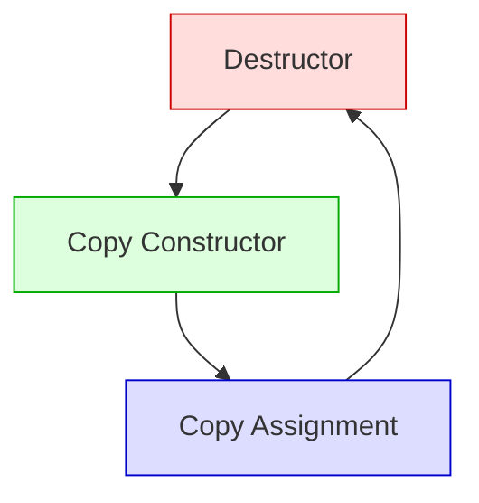

Perfect ✅ — so you want **Mermaid diagrams inside Markdown** and a **slide-by-slide layout** (each slide separated by `---`).

Here’s the complete illustrated Markdown version of your **“Rule of Three — C++”** presentation, ready for GitHub, Obsidian, or VS Code preview:

---

# Rule of Three — C++

CPSC 131 · CSU Fullerton
**Kevin A. Wortman**

---

## Slide 1 — Rule of Three Overview

### Recall: RAII (Resource Acquisition Is Initialization)

* **Constructor** → responsible for `new` (memory allocation)
* **Destructor** → responsible for `delete` (memory release)

### The Rule of Three

If a class defines **any one** of these, it must define **all three**:

1. **Destructor**
2. **Copy constructor**
3. **Copy assignment operator**

These functions handle **object initialization** and **resource management**.



---

## Slide 2 — Why It Matters

* These member functions **initialize** and **manage** an object’s owned memory.
* Improper handling leads to:

  * 🔴 **Double deletion**
  * 🔴 **Memory leaks**
  * 🔴 **Dangling pointers**



---

## Slide 3 — Example: `MaybeInt`

A class that may or may not own an integer in dynamic memory.

```cpp
class MaybeInt {
 public:
  MaybeInt() : value_(nullptr) {}
  MaybeInt(int value) : value_(new int(value)) {}

  ~MaybeInt() {
    if (value_ != nullptr) {
      delete value_;
    }
  }

 private:
  int* value_;
};
```



---

## Slide 4 — Bug Example

```cpp
int main() {
  MaybeInt a(7);
  MaybeInt b(a); // Copy constructor (shallow)
  MaybeInt c;
  c = a;         // Copy assignment (shallow)
  return 0;
}
```

### Result — ❌ Undefined Behavior

```mermaid
flowchart TD
A[a::value_ → 7]
B[b::value_ → same pointer as a]
C[c::value_ → nullptr]
X["🅧 Double delete when destructors run"]
A --> X
B --> X
C --> X
```



Both `a` and `b` try to `delete` the same memory.

---

## Slide 5 — Fix: Define All Three

You must handle memory safely across:

* Destructor
* Copy constructor
* Copy assignment operator

```cpp
class MaybeInt {
 public:
  MaybeInt() : value_(nullptr) {}
  MaybeInt(int value) : value_(new int(value)) {}

  // Copy constructor
  MaybeInt(const MaybeInt& other) {
    if (other.value_ == nullptr)
      value_ = nullptr;
    else
      value_ = new int(*other.value_);
  }

  // Copy assignment operator
  MaybeInt& operator=(const MaybeInt& other) {
    if (this != &other) {
      delete value_;
      if (other.value_ == nullptr)
        value_ = nullptr;
      else
        value_ = new int(*other.value_);
    }
    return *this;
  }

  // Destructor
  ~MaybeInt() { delete value_; }

 private:
  int* value_;
};
```

---

### Diagram — ✅ Correct Copy Semantics

```mermaid
flowchart TD
A[a::value_ → new(7)]
B[b::value_ → new(7)]
C[c::value_ → new(7)]

A -->|"Copy Constructor"| B
A -->|"Assignment Operator"| C
```

* Each object owns its **own** integer.
* No shared pointers.
* No double deletion.

---

## Slide 6 — Modern Alternatives

Instead of manual memory handling, prefer:

* **`std::optional<int>`**
* **`std::unique_ptr<int>`**

They follow **RAII** and eliminate the need for the Rule of Three.

```mermaid
flowchart LR
A["Manual new/delete (MaybeInt)"] -->|"❌ Error-prone"| X["Double delete risk"]
B["std::unique_ptr<int>"] -->|"✅ RAII handles lifetime"| Y["Safe memory"]
C["std::optional<int>"] -->|"✅ Value semantics"| Y
```



---

## Slide 7 — Summary Table

| Function                     | Purpose                | Must Handle      |
| ---------------------------- | ---------------------- | ---------------- |
| **Destructor**               | Destroys object        | `delete`         |
| **Copy constructor**         | Duplicates object      | `new`            |
| **Copy assignment operator** | Replaces existing data | `delete` + `new` |

> 🧠 **Rule of Three:**
> If you define **one**, you must define **all three**.



---

Would you like me to now generate **the image-enhanced version** (with SVG renderings of the code and UML) from this Markdown — so it’s ready for PDF export or slides?
