```mermaid
flowchart TD
%% Layout Analysis Diagram
S0["Bug Example: MaybeInt"]
S1["class MaybeInt {  public:   MaybeInt() : value_(nullptr) {}    MaybeInt(int value)   : value_(new int(value)) {}    ~MaybeInt() {     if ..."]
S2["…  int main(int argc, char* argv[]) {   MaybeInt a(7);   MaybeInt b(a);   MaybeInt c;   c = a;   return 0; }"]
S0 -. vertically aligned .-> S1
S1 -. horizontally aligned .-> S2
```

```mermaid
flowchart TD
%% Layout Analysis Diagram
S0["(invalid)"]
S1["Bug Example: MaybeInt"]
S2["…  int main(int argc, char* argv[]) {   MaybeInt a(7);   MaybeInt b(a);   MaybeInt c;   c = a;   return 0; }"]
S3["a::value_"]
S4["7"]
S5["b::value_"]
S6["c::value_"]
S7["nullptr"]
S8["🅧 double delete"]
subgraph cluster_1
S0
S4
S8
end
subgraph cluster_2
S0
S4
end
subgraph cluster_3
S0
S8
end
S0 --> S4
S0 --> S8
S0 -. horizontally aligned .-> S3
S0 -. horizontally aligned .-> S4
S3 -. horizontally aligned .-> S4
S3 -. vertically aligned .-> S5
S3 -. vertically aligned .-> S6
S4 --> S8
S4 -. vertically aligned .-> S7
S5 -. vertically aligned .-> S6
S6 -. horizontally aligned .-> S7
```

# rule of three — Slide Export

---

## Slide 1

### C++: Rule of Three

C++: Rule of Three

CPSC 131 ~ CSU Fullerton
Kevin A. Wortman

#### Layout Diagram


---

## Slide 2

### C++ Rule of Three

C++ Rule of Three

```cpp
Recall RAII
constructor is solely responsible for new
destructor is solely responsible for delete
Rule of Three: if a class defines any of these, it must define all three:
Destructor
Copy constructor
Copy assignment operator
```

#### Layout Diagram


---

## Slide 3

### Why?

Why?

These are the member functions that initialize an object
Obligated to handle new/delete
Recall
Destructor: called to destroy an object ~ needs to delete owned data members
Copy constructor: called to copy an object ~ needs to make a new copy
Copy assignment operator: called to assign = an object ~ needs to make a new copy

#### Layout Diagram


---

## Slide 4

### Example: MaybeInt

Example: MaybeInt

```cpp
class MaybeInt: either owns
One integer in dynamic memory; or
Nothing
Example to illustrate Rule of Three
Single responsibility principle: better to use std::optional instead
```

#### Layout Diagram


---

## Slide 5

### Bug Example: MaybeInt

Bug Example: MaybeInt

```cpp
class MaybeInt { public:  MaybeInt() : value_(nullptr) {}  MaybeInt(int value)  : value_(new int(value)) {}  ~MaybeInt() {    if (value_ != nullptr) {      delete value_;    }   }…private:  int* value_;};
```

```cpp
… int main(int argc, char* argv[]) {  MaybeInt a(7);  MaybeInt b(a);  MaybeInt c;  c = a;  return 0;}
```

#### Layout Diagram




---

## Slide 6

### Bug Example: MaybeInt

(invalid)

Bug Example: MaybeInt

a::value_

7

b::value_

c::value_

nullptr

🅧 double delete

```cpp
… int main(int argc, char* argv[]) {  MaybeInt a(7);  MaybeInt b(a);  MaybeInt c;  c = a;  return 0;}
```

#### Layout Diagram




---

## Slide 7

### Solution: All 3 Initialization Functions Must new

Solution: All 3 Initialization Functions Must new

Destructor: called to destroy an object ~ needs to delete owned data members
Copy constructor: called to copy an object ~ needs to make a new copy
Copy assignment operator: called to assign = an object ~ needs to make a new copy

#### Layout Diagram


---

## Slide 8

### Example: MaybeInt

Example: MaybeInt

```cpp
  MaybeInt() : value_(nullptr) {}  MaybeInt(int value)  : value_(new int(value)) {}  MaybeInt(const MaybeInt& other) {    if (other.value_ == nullptr) {      value_ = nullptr;    } else {      value_ = new int(*other.value_);    }  }  ~MaybeInt() {    if (value_ != nullptr) {      delete value_;    }   }
```

```cpp
  MaybeInt& operator=(const MaybeInt& other) {    if (value_ != nullptr) {      delete value_;    }    if (other.value_ == nullptr) {      value_ = nullptr;    } else {      value_ = new int(*other.value_);    }  }… int main(int argc, char* argv[]) {  MaybeInt a(7);  MaybeInt b(a);  MaybeInt c;  c = a;  return 0;}
```

#### Layout Diagram


---

## Slide 9

### Example: MaybeInt

Example: MaybeInt

a::value_

7

b::value_

7

c::value_

7

(invalid)

(invalid)

(invalid)

```cpp
… int main(int argc, char* argv[]) {  MaybeInt a(7);  MaybeInt b(a);  MaybeInt c;  c = a;  return 0;}
```

#### Layout Diagram


