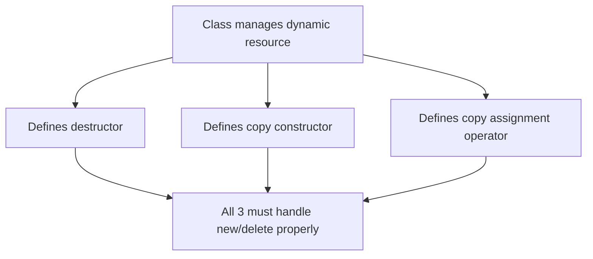
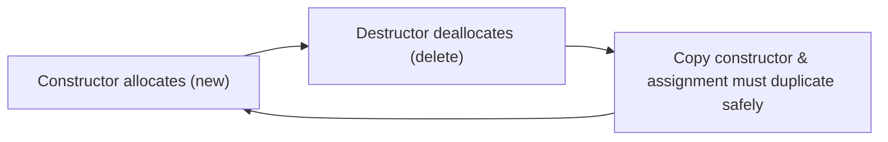
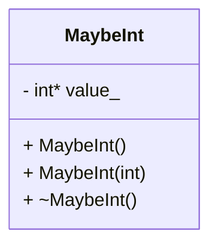
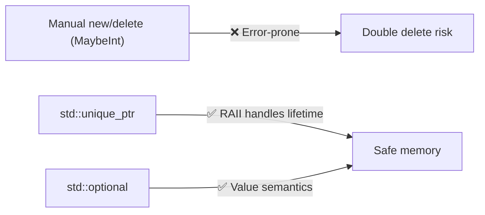
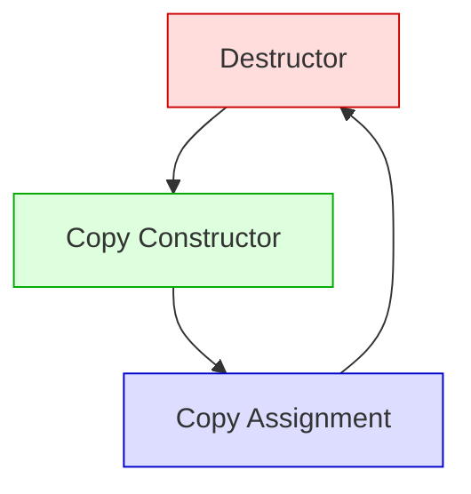

# Rule of Three — C++

CPSC 131 · CSU Fullerton
**Kevin A. Wortman**

---

## Slide 1 — Rule of Three Overview

### Recall: RAII (Resource Acquisition Is Initialization)

* **Constructor** → responsible for `new` (memory allocation)
* **Destructor** → responsible for `delete` (memory release)

### The Rule of Three

If a class defines **any one** of these, it must define **all three**:

1. **Destructor**
2. **Copy constructor**
3. **Copy assignment operator**

These functions handle **object initialization** and **resource management**.



---

## Slide 2 — Why It Matters

* These member functions **initialize** and **manage** an object’s owned memory.
* Improper handling leads to:

  * 🔴 **Double deletion**
  * 🔴 **Memory leaks**
  * 🔴 **Dangling pointers**



---

## Slide 3 — Example: `MaybeInt`

A class that may or may not own an integer in dynamic memory.

```cpp
class MaybeInt {
 public:
  MaybeInt() : value_(nullptr) {}
  MaybeInt(int value) : value_(new int(value)) {}

  ~MaybeInt() {
    if (value_ != nullptr) {
      delete value_;
    }
  }

 private:
  int* value_;
};
```



---

## Slide 4 — Bug Example

```cpp
int main() {
  MaybeInt a(7);
  MaybeInt b(a); // Copy constructor (shallow)
  MaybeInt c;
  c = a;         // Copy assignment (shallow)
  return 0;
}
```

### 🔗 Interactive Visualization

👉 [View in Python Tutor](https://pythontutor.com/render.html#code=class%20MaybeInt%20%7B%0A%20public%3A%0A%20%20MaybeInt%28%29%20%3A%20value_%28nullptr%29%20%7B%7D%0A%20%20MaybeInt%28int%20value%29%20%3A%20value_%28new%20int%28value%29%29%20%7B%7D%0A%0A%20%20~MaybeInt%28%29%20%7B%0A%20%20%20%20if%20%28value_%20!%3D%20nullptr%29%20%7B%0A%20%20%20%20%20%20delete%20value_%3B%0A%20%20%20%20%7D%0A%20%20%7D%0A%0A%20private%3A%0A%20%20int*%20value_%3B%0A%7D%3B%0A%0Aint%20main%28%29%20%7B%0A%20%20MaybeInt%20a%287%29%3B%0A%20%20MaybeInt%20b%28a%29%3B%20//%20Copy%20constructor%20%28shallow%29%0A%20%20MaybeInt%20c%3B%0A%20%20c%20%3D%20a%3B%20%20%20%20%20%20%20%20%20//%20Copy%20assignment%20%28shallow%29%0A%20%20return%200%3B%0A%7D&cumulative=false&curInstr=12&heapPrimitives=nevernest&mode=display&origin=opt-frontend.js&py=cpp_g%2B%2B9.3.0&rawInputLstJSON=%5B%5D&textReferences=false)

---
```dot
digraph DoubleDelete {
    rankdir=LR;
    node [shape=box, style=rounded, fontname="Consolas"];

    subgraph cluster_stack {
        label="Stack";
        color="#cccccc";
        a [label="a::value_"];
        b [label="b::value_"];
        c [label="c::value_"];
    }

    subgraph cluster_heap {
        label="Heap";
        color="#cccccc";
        v [label="7 (invalid)"];
        x [label="❌ double delete", color="red", fontcolor="red", style="filled", fillcolor="#ffe6e6"];
    }

    a -> v;
    b -> v;
    c -> v;

    {rank=same; v; x;}  // Keeps "❌ double delete" next to 7
}


### Result — ❌ Undefined Behavior

```mermaid
flowchart TD
A[a::value_ → 7]
B[b::value_ → same pointer as a]
C[c::value_ → nullptr]
X["🅧 Double delete when destructors run"]
A --> X
B --> X
C --> X
```

Both `a` and `b` try to `delete` the same memory.

---

## Slide 5 — Fix: Define All Three

You must handle memory safely across:

* Destructor
* Copy constructor
* Copy assignment operator

```cpp
class MaybeInt {
 public:
  MaybeInt() : value_(nullptr) {}
  MaybeInt(int value) : value_(new int(value)) {}

  // Copy constructor
  MaybeInt(const MaybeInt& other) {
    if (other.value_ == nullptr)
      value_ = nullptr;
    else
      value_ = new int(*other.value_);
  }

  // Copy assignment operator
  MaybeInt& operator=(const MaybeInt& other) {
    if (this != &other) {
      delete value_;
      if (other.value_ == nullptr)
        value_ = nullptr;
      else
        value_ = new int(*other.value_);
    }
    return *this;
  }

  // Destructor
  ~MaybeInt() { delete value_; }

 private:
  int* value_;
};
```

---

### Diagram — ✅ Correct Copy Semantics

```mermaid
flowchart TD
A[a::value_ → new(7)]
B[b::value_ → new(7)]
C[c::value_ → new(7)]

A -->|"Copy Constructor"| B
A -->|"Assignment Operator"| C
```

* Each object owns its **own** integer.
* No shared pointers.
* No double deletion.

---

## Slide 6 — Modern Alternatives

Instead of manual memory handling, prefer:

* **`std::optional<int>`**
* **`std::unique_ptr<int>`**

They follow **RAII** and eliminate the need for the Rule of Three.



---

## Slide 7 — Summary Table

| Function                     | Purpose                | Must Handle      |
| ---------------------------- | ---------------------- | ---------------- |
| **Destructor**               | Destroys object        | `delete`         |
| **Copy constructor**         | Duplicates object      | `new`            |
| **Copy assignment operator** | Replaces existing data | `delete` + `new` |

> 🧠 **Rule of Three:**
> If you define **one**, you must define **all three**.



---

Would you like me to now generate **the image-enhanced version** (with SVG renderings of the code and UML) from this Markdown — so it’s ready for PDF export or slides?
