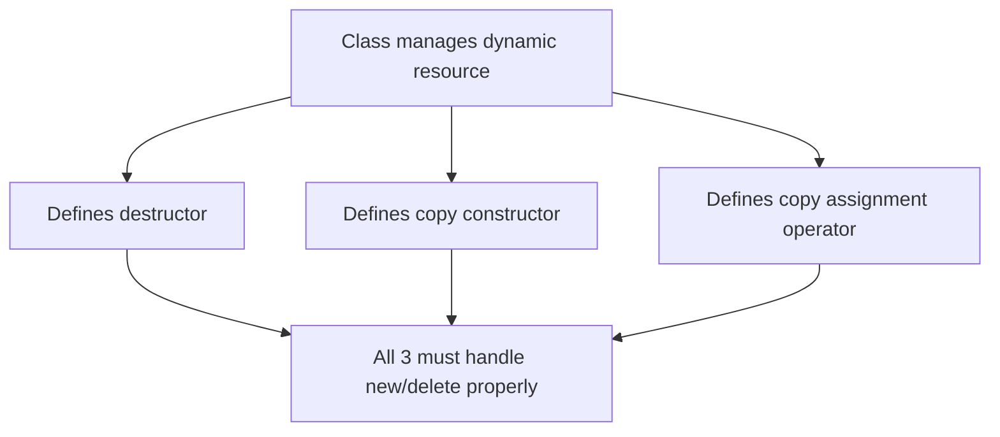
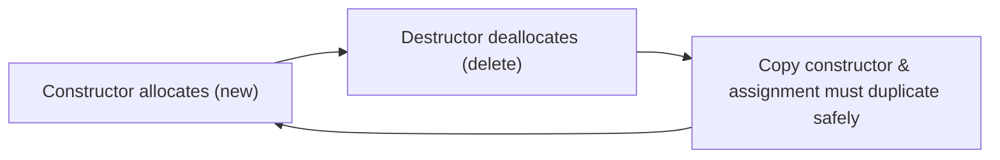
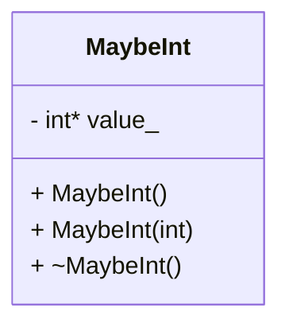

# Rule of Three — C++

### The Rule of Three

If a class defines **any one** of these, it must define **all three**:

1. **Destructor**
2. **Copy constructor**
3. **Copy assignment operator**

These functions handle **object initialization** and **resource management**.


    <pre class="mermaid">
    graph TD;
        A-->B;
        B-->C;
    </pre>
    <script src="https://cdn.jsdelivr.net/npm/mermaid/dist/mermaid.min.js"></script>
    <script>mermaid.initialize({startOnLoad:true});</script>
---

##  Why It Matters

* These member functions **initialize** and **manage** an object’s owned memory.
* Improper handling leads to:

  * 🔴 **Double deletion**
  * 🔴 **Memory leaks**
  * 🔴 **Dangling pointers**



---

## Slide 3 — Example: `MaybeInt`

A class that may or may not own an integer in dynamic memory.

```cpp
class MaybeInt {
 public:
  MaybeInt() : value_(nullptr) {}
  MaybeInt(int value) : value_(new int(value)) {}

  ~MaybeInt() {
    if (value_ != nullptr) {
      delete value_;
    }
  }

 private:
  int* value_;
};
```



---

##  Bug Example

```cpp
int main() {
  MaybeInt a(7);
  MaybeInt b(a); // Copy constructor (shallow)
  MaybeInt c;
  c = a;         // Copy assignment (shallow)
  return 0;
}
```

### 🔗 Interactive Visualization

👉 [View in Python Tutor](https://pythontutor.com/render.html#code=class%20MaybeInt%20%7B%0A%20public%3A%0A%20%20MaybeInt%28%29%20%3A%20value_%28nullptr%29%20%7B%7D%0A%20%20MaybeInt%28int%20value%29%20%3A%20value_%28new%20int%28value%29%29%20%7B%7D%0A%0A%20%20~MaybeInt%28%29%20%7B%0A%20%20%20%20if%20%28value_%20!%3D%20nullptr%29%20%7B%0A%20%20%20%20%20%20delete%20value_%3B%0A%20%20%20%20%7D%0A%20%20%7D%0A%0A%20private%3A%0A%20%20int*%20value_%3B%0A%7D%3B%0A%0Aint%20main%28%29%20%7B%0A%20%20MaybeInt%20a%287%29%3B%0A%20%20MaybeInt%20b%28a%29%3B%20//%20Copy%20constructor%20%28shallow%29%0A%20%20MaybeInt%20c%3B%0A%20%20c%20%3D%20a%3B%20%20%20%20%20%20%20%20%20//%20Copy%20assignment%20%28shallow%29%0A%20%20return%200%3B%0A%7D&cumulative=false&curInstr=12&heapPrimitives=nevernest&mode=display&origin=opt-frontend.js&py=cpp_g%2B%2B9.3.0&rawInputLstJSON=%5B%5D&textReferences=false)

---
### Animation


<div id="pointer-animation1">
    <canvas id="pointerCanvas1" width="600" height="350"></canvas>
</div>

<script>
const canvas = document.getElementById('pointerCanvas1');
const ctx = canvas.getContext('2d');

let step = 0;

// Stack pointers
const stack = [
    {name: 'a::value_', x: 50, y: 60, target: null},
    {name: 'b::value_', x: 50, y: 110, target: null},
    {name: 'c::value_', x: 50, y: 160, target: null}
];

// Heap object
const heap = {name: '7', x: 300, y: 110, invalid: false, visible: false};

// Nullptr position
const nullptrPos = {name: 'nullptr', x: 350, y: 230, visible:false};

// Flag for double delete
let showDoubleDelete = false;

// Draw a pointer line from stack to target
function drawPointer(obj) {
    if(!obj.target) return;
    ctx.beginPath();
    ctx.moveTo(obj.x + 70, obj.y + 10);
    ctx.lineTo(obj.target.x, obj.target.y + 10);
    ctx.strokeStyle = obj.target.name === 'nullptr' ? 'red' : 'black';
    ctx.lineWidth = 2;
    ctx.stroke();

    // Draw stack box
    ctx.fillStyle = '#87CEFA';
    ctx.fillRect(obj.x, obj.y, 70, 20);
    ctx.strokeRect(obj.x, obj.y, 70, 20);
    ctx.fillStyle = 'black';
    ctx.fillText(obj.name, obj.x + 5, obj.y + 15);
}

// Draw heap and nullptr blocks
function drawHeap() {
    if(heap.visible) {
        ctx.fillStyle = heap.invalid ? '#FF6347' : '#90EE90';
        ctx.fillRect(heap.x, heap.y, 70, 20);
        ctx.strokeRect(heap.x, heap.y, 70, 20);
        ctx.fillStyle = 'black';
        const displayName = heap.invalid ?  " (invalid)" : heap.name;
        ctx.fillText(displayName, heap.x + 5, heap.y + 15);
    }
    if(nullptrPos.visible) {
        ctx.fillStyle = '#FFD700';
        ctx.fillRect(nullptrPos.x, nullptrPos.y, 70, 20);
        ctx.strokeRect(nullptrPos.x, nullptrPos.y, 70, 20);
        ctx.fillStyle = 'black';
        ctx.fillText(nullptrPos.name, nullptrPos.x + 5, nullptrPos.y + 15);
    }
}

// Draw the double delete marker
function drawDoubleDelete() {
    if(showDoubleDelete) {
        ctx.fillStyle = 'red';
        ctx.font = '20px sans-serif';
        ctx.fillText('❌ double delete', heap.x + 80, heap.y + 15);
    }
}

// Draw canvas buttons
function drawButtons() {
    ctx.fillStyle = '#E0E0E0';
    ctx.strokeStyle = '#666';
    ctx.lineWidth = 1;

    // Prev button
    ctx.fillRect(150, 300, 80, 30);
    ctx.strokeRect(150, 300, 80, 30);
    ctx.fillStyle = 'black';
    ctx.fillText('Prev', 175, 320);

    // Next button
    ctx.fillStyle = '#E0E0E0';
    ctx.strokeStyle = '#666';
    ctx.fillRect(270, 300, 80, 30);
    ctx.strokeRect(270, 300, 80, 30);
    ctx.fillStyle = 'black';
    ctx.fillText('Next', 295, 320);
}

// Draw everything
function drawStep() {
    ctx.clearRect(0, 0, canvas.width, canvas.height);
    ctx.fillStyle = 'black';
    ctx.font = '16px sans-serif';
    ctx.fillText("Step: " + step, 10, 25);
    drawHeap();
    stack.forEach(drawPointer);
    drawDoubleDelete();
    drawButtons();
}

// Move to next step
function nextStep() {
    if(step>6) return;
    step++;
    applyStep();
}

// Move to previous step
function prevStep() {
    if (step > 0) step--;
    resetToStep(step);
}

// Apply step logic
function applyStep() {
    switch(step) {
        case 1: stack[0].target = heap; heap.visible = true; break;
        case 2: stack[1].target = heap; break;
        case 3: stack[2].target = nullptrPos; nullptrPos.visible = true; break;
        case 4: stack[2].target = heap; break;
        case 5: heap.invalid = true; break;
        case 6: heap.visible = false; showDoubleDelete = true; break;
        default: break;
    }
    drawStep();
}

// Reset all and replay steps up to given index
function resetToStep(n) {
    stack.forEach(s => s.target = null);
    heap.invalid = false;
    heap.visible = false;
    nullptrPos.visible = false;
    showDoubleDelete = false;

    for (let i = 1; i <= n; i++) {
        switch(i) {
            case 1: stack[0].target = heap; heap.visible = true; break;
            case 2: stack[1].target = heap; break;
            case 3: stack[2].target = nullptrPos; nullptrPos.visible = true; break;
            case 4: stack[2].target = heap; break;
            case 5: heap.invalid = true; break;
            case 6: heap.visible = false; showDoubleDelete = true; break;
        }
    }
    drawStep();
}

// Handle canvas click events for Prev/Next buttons
canvas.addEventListener('click', (e) => {
    const rect = canvas.getBoundingClientRect();
    const x = e.clientX - rect.left;
    const y = e.clientY - rect.top;

    // Prev button bounds
    if (x >= 150 && x <= 230 && y >= 300 && y <= 330) {
        prevStep();
    }
    // Next button bounds
    else if (x >= 270 && x <= 350 && y >= 300 && y <= 330) {
        nextStep();
    }
});

// Initial draw
drawStep();
</script>


Both `a` and `b` try to `delete` the same memory.

---

##  Fix: Define All Three

You must handle memory safely across:

* Destructor
* Copy constructor
* Copy assignment operator

```cpp
class MaybeInt {
 public:
  MaybeInt() : value_(nullptr) {}
  MaybeInt(int value) : value_(new int(value)) {}

  // Copy constructor
  MaybeInt(const MaybeInt& other) {
    if (other.value_ == nullptr)
      value_ = nullptr;
    else
      value_ = new int(*other.value_);
  }

  // Copy assignment operator
  MaybeInt& operator=(const MaybeInt& other) {
    if (this != &other) {
      delete value_;
      if (other.value_ == nullptr)
        value_ = nullptr;
      else
        value_ = new int(*other.value_);
    }
    return *this;
  }

  // Destructor
  ~MaybeInt() { delete value_; }

 private:
  int* value_;
};
```

---

### Diagram — ✅ Correct Copy Semantics

<iframe width="800" height="500" frameborder="0" src="https://pythontutor.com/iframe-embed.html#code=class%20MaybeInt%20%7B%0A%20public%3A%0A%20%20MaybeInt%28%29%20%3A%20value_%28nullptr%29%20%7B%7D%0A%20%20MaybeInt%28int%20value%29%20%3A%20value_%28new%20int%28value%29%29%20%7B%7D%0A%0A%20%20//%20Copy%20constructor%0A%20%20MaybeInt%28const%20MaybeInt%26%20other%29%20%7B%0A%20%20%20%20if%20%28other.value_%20%3D%3D%20nullptr%29%0A%20%20%20%20%20%20value_%20%3D%20nullptr%3B%0A%20%20%20%20else%0A%20%20%20%20%20%20value_%20%3D%20new%20int%28*other.value_%29%3B%0A%20%20%7D%0A%0A%20%20//%20Copy%20assignment%20operator%0A%20%20MaybeInt%26%20operator%3D%28const%20MaybeInt%26%20other%29%20%7B%0A%20%20%20%20if%20%28this%20!%3D%20%26other%29%20%7B%0A%20%20%20%20%20%20delete%20value_%3B%0A%20%20%20%20%20%20if%20%28other.value_%20%3D%3D%20nullptr%29%0A%20%20%20%20%20%20%20%20value_%20%3D%20nullptr%3B%0A%20%20%20%20%20%20else%0A%20%20%20%20%20%20%20%20value_%20%3D%20new%20int%28*other.value_%29%3B%0A%20%20%20%20%7D%0A%20%20%20%20return%20*this%3B%0A%20%20%7D%0A%0A%20%20//%20Destructor%0A%20%20~MaybeInt%28%29%20%7B%20delete%20value_%3B%20%7D%0A%0A%20private%3A%0A%20%20int*%20value_%3B%0A%7D%3B%0A%0Aint%20main%28%29%20%7B%0A%20%20MaybeInt%20a%287%29%3B%0A%20%20MaybeInt%20b%28a%29%3B%20//%20Copy%20constructor%20%28shallow%29%0A%20%20MaybeInt%20c%3B%0A%20%20c%20%3D%20a%3B%20%20%20%20%20%20%20%20%20//%20Copy%20assignment%20%28shallow%29%0A%20%20return%200%3B%0A%7D&codeDivHeight=400&codeDivWidth=350&cumulative=false&curInstr=0&heapPrimitives=nevernest&origin=opt-frontend.js&py=cpp_g%2B%2B9.3.0&rawInputLstJSON=%5B%5D&textReferences=false"> </iframe>


* Each object owns its **own** integer.
* No shared pointers.
* No double deletion.


---

##  Summary Table

| Function                     | Purpose                | Must Handle      |
| ---------------------------- | ---------------------- | ---------------- |
| **Destructor**               | Destroys object        | `delete`         |
| **Copy constructor**         | Duplicates object      | `new`            |
| **Copy assignment operator** | Replaces existing data | `delete` + `new` |

> 🧠 **Rule of Three:**
> If you define **one**, you must define **all three**.
