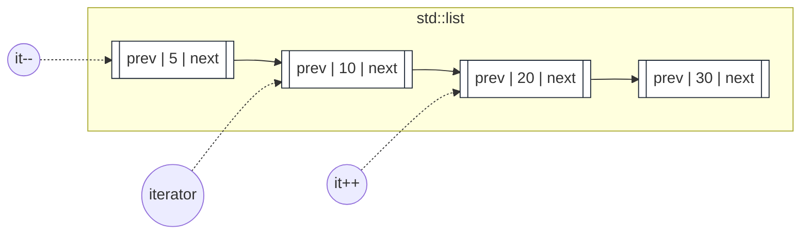
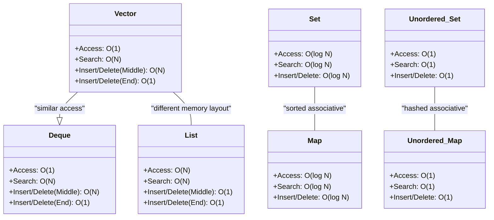
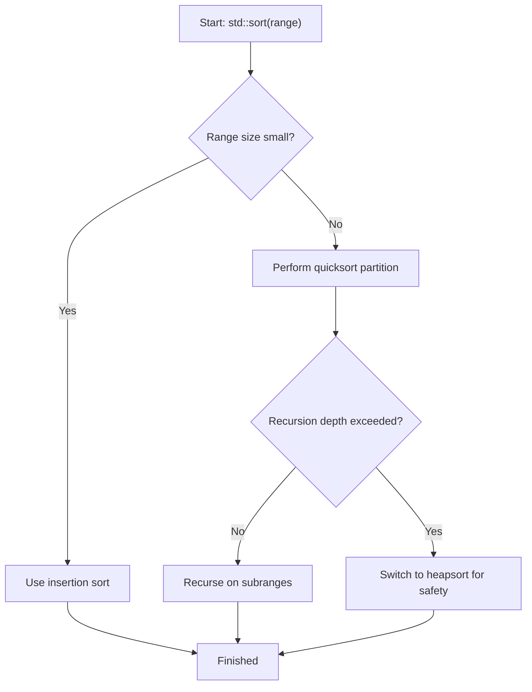
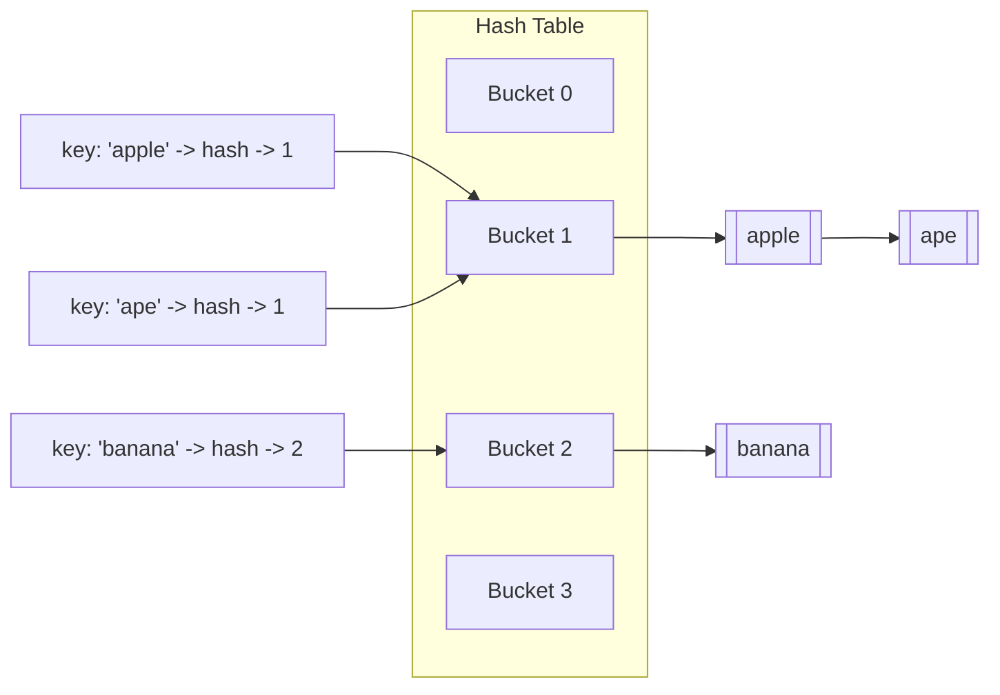

# C++ STL Guide

The C++ Standard Template Library (STL) is a cornerstone of modern C++ development. It provides a robust set of generic classes and functions for data management and common computational tasks.

This guide explores the main components—**containers**, **iterators**, and **algorithms**—with detailed explanations and C++ syntax examples. Mermaid diagrams are included to visualize iterators and container characteristics. (Render Mermaid diagrams in a viewer that supports Mermaid, like GitHub, GitLab, or some Markdown preview extensions in editors.)

---


## 🧰 Containers

### `std::vector` (Dynamic Array)

* **Strengths:** Fast random access `O(1)`.
* **Weaknesses:** Slow insertion/deletion in the middle `O(N)`.

```cpp
#include <iostream>
#include <vector>

int main() {
    std::vector<int> numbers;
    numbers.push_back(10);
    numbers.push_back(30);

    std::cout << "Initial size: " << numbers.size() << std::endl;

    numbers.insert(numbers.begin() + 1, 20);

    std::cout << "Vector contents:" << std::endl;
    for (size_t i = 0; i < numbers.size(); ++i) {
        std::cout << numbers[i] << " ";
    }
    std::cout << std::endl;

    numbers.pop_back();
    std::cout << "Front: " << numbers.front() << ", Back: " << numbers.back() << std::endl;
}
```

**Expected Output:**

```
Initial size: 2
Vector contents:
10 20 30
Front: 10, Back: 20
```

---

### `std::list` (Doubly-Linked List)

* **Strengths:** Constant-time insertion/deletion at any position `O(1)`.
* **Weaknesses:** No random access.

```cpp
#include <iostream>
#include <list>

int main() {
    std::list<int> my_list;
    my_list.push_back(10);
    my_list.push_back(20);
    my_list.push_front(5);

    my_list.pop_front();
    my_list.pop_back();

    my_list.remove(10); // removes all 10s
}
```

**Key Methods:**

* `push_front() / pop_front()`
* `push_back() / pop_back()`
* `remove(value)`

---
### Iterator Movement on `std::list` (bidirectional)



> This diagram shows a doubly-linked list where each node links to both previous and next nodes. `it++` moves forward; `it--` moves backward.

### `std::deque` (Double-Ended Queue)

* **Strengths:** Fast access `O(1)`, insertion/deletion at both ends `O(1)`.

```cpp
#include <iostream>
#include <deque>

int main() {
    std::deque<int> my_deque;
    my_deque.push_back(10);
    my_deque.push_front(5);
    my_deque.push_back(15);

    std::cout << "Front: " << my_deque.front() << ", Back: " << my_deque.back() << std::endl;

    my_deque.pop_front();
    my_deque.pop_back();
}
```

---

### `std::set` (Sorted Set)

* Stores **unique** elements in sorted order.
* Lookup in `O(log N)`.

```cpp
#include <iostream>
#include <set>

int main() {
    std::set<int> my_set;
    my_set.insert(30);
    my_set.insert(10);
    my_set.insert(20);
    my_set.insert(10); // ignored

    if (my_set.count(20)) {
        std::cout << "20 is in the set." << std::endl;
    }
    
    my_set.erase(30);
}
```

**Key Methods:**

* `insert(value)`
* `find(value)`
* `count(value)`
* `erase(value)`


If you need to have duplicate, you can use multiset
---

### `std::map` (Sorted Key-Value Pairs)

* Stores key-value pairs sorted by key.
* Lookup `O(log N)`.

```cpp
#include <iostream>
#include <map>
#include <string>

int main() {
    std::map<std::string, int> ages;
    ages.insert(std::make_pair("John", 30));
    ages["Jane"] = 25;

    std::cout << "Jane's age: " << ages["Jane"] << std::endl;

    if (ages.count("John")) {
        std::cout << "Found John." << std::endl;
    }
    ages.erase("John");
}
```

---

### `std::unordered_set` (Hashed Set)

* Stores unique elements with average `O(1)` lookups.
* No ordering.

```cpp
#include <iostream>
#include <unordered_set>

int main() {
    std::unordered_set<int> my_set;
    my_set.insert(30);
    my_set.insert(10);
    my_set.insert(20);

    if (my_set.count(20)) {
        std::cout << "20 is in the set." << std::endl;
    }
}
```

---

### `std::unordered_map` (Hashed Key-Value Pairs)

* Fastest key-value dictionary.
* Average `O(1)` lookup.

```cpp
#include <iostream>
#include <unordered_map>
#include <string>

int main() {
    std::unordered_map<std::string, int> ages;
    ages["John"] = 30;
    ages["Jane"] = 25;

    ages["Jane"] = 26; // Update
    std::cout << "Jane's new age: " << ages["Jane"] << std::endl;
}
```

---

## 📊 Container Performance Comparison (Big O)

Understanding the performance trade-offs between different containers is crucial for writing efficient code. This table summarizes the average time complexities:

| Operation                  | `vector` | `list` | `deque` | `set`    | `map`    | `unordered_set` | `unordered_map` |
| -------------------------- | -------- | ------ | ------- | -------- | -------- | --------------- | --------------- |
| **Access**                 | O(1)     | O(N)   | O(1)    | O(log N) | O(log N) | O(1)            | O(1)            |
| **Search**                 | O(N)     | O(N)   | O(N)    | O(log N) | O(log N) | O(1)            | O(1)            |
| **Insert/Delete (Middle)** | O(N)     | O(1)   | O(N)    | O(log N) | O(log N) | O(1)            | O(1)            |
| **Insert/Delete (End)**    | O(1)     | O(1)   | O(1)    | O(log N) | O(log N) | O(1)            | O(1)            |

---

## 🔗 Iterators

Iterators act like **pointers** that connect containers to algorithms. They allow traversal without exposing the internal structure.

**Types of Iterators:**

* Random Access (`vector`, `deque`)
* Bidirectional (`list`, `set`, `map`)
* Forward

```cpp
std::vector<int> numbers = {10, 20, 30};
std::vector<int>::iterator it = numbers.begin();
it++; // now points to 20
std::cout << *it; // prints 20
```

```cpp

for(std::vector<int>::iterator it=numbers.begin(); it!=numbers.end();it++){
    std::cout  << *it;
}
```
---

## ⚙️ Algorithms

Algorithms are generic functions from `<algorithm>`, operating on iterator ranges.

**Common Algorithms:**

* `std::sort(begin, end)`
* `std::find(begin, end, value)`
* `std::count(begin, end, value)`
* `std::accumulate(begin, end, initial_sum)`

```cpp
std::vector<int> nums = {5, 2, 8, 1};
std::sort(nums.begin(), nums.end());
// nums is now {1, 2, 5, 8}
```

---

## Mermaid Diagrams

### Iterator Movement (flowchart)

<pre class="mermaid">
flowchart LR
  subgraph V [std::vector<int>]
    v0["0: 10"] --> v1["1: 20"] --> v2["2: 30"]
  end
  it0((iterator)) --> v0
  v0 -- "+ +" --> v1
  v1 -- "+ +" --> v2
  classDef itStyle fill:#f8fafc,stroke:#334155,stroke-width:2px;
  class it0 itStyle;
  </pre>

> Use this diagram to visualize how `it++` moves an iterator from element to element in a random-access container like `std::vector`.

### Containers Class Diagram (complexities)



---


### `std::sort` — High-Level Flow (introsort simplified)



> This flowchart summarizes the high-level decisions behind `std::sort` (introspective sort): small ranges use insertion sort; otherwise quicksort is used but if recursion goes too deep (worst-case), it switches to heapsort to guarantee `O(n log n)` behavior.

### Hashing & Buckets (`std::unordered_map`) — Collision Handling (chaining)



> Shows how two keys (`"apple"` and `"ape"`) can map to the same bucket and be stored via chaining (linked-list) inside that bucket.

---

    <script type="module">
      import mermaid from 'https://cdn.jsdelivr.net/npm/mermaid@10/dist/mermaid.esm.min.mjs';
      mermaid.initialize({ startOnLoad: true, theme: 'default' }); // Adjust theme as needed
    </script>
